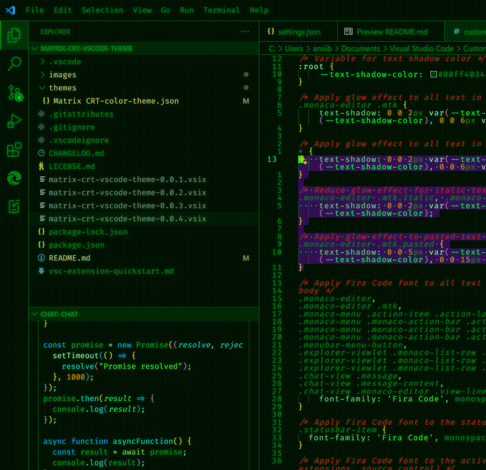

 

 


 <a href="https://www.buymeacoffee.com/mramii" target="_blank"></a>


# After installation Guide

## Getting font, line numbers and terminal cursor blink

- Add the following to your settings.json

``` "editor.lineNumbers": "relative", //Used for navigation with vim, otherwise replace relative with on

    "editor.fontFamily": "Fira Code, Cascadia Code, Consolas, Courier New, monospace",
    "editor.fontLigatures": true,
    "editor.fontWeight": "normal",
    "editor.fontSize": 12.5,
    "editor.lineHeight": 1.1,
    "editor.letterSpacing": 1, 
    "editor.cursorStyle": "line",
    "editor.cursorWidth": 2,
    "editor.cursorBlinking": "blink",
    "editor.renderWhitespace": "selection",
    "editor.renderControlCharacters": true,
    "editor.renderLineHighlight": "line",
    "editor.renderFinalNewline": "dimmed",

    "terminal.integrated.fontFamily": "Fira Code, Cascadia Code, Consolas, Courier New, monospace",
        "terminal.integrated.cursorBlinking": true
    }
```


 
**(navigate there by pressing Ctrl+Shift+p and typing settings and selecting Preferences: User settings(JSON), then paste the following block in respecting the norms.)**

## Create glowing text effect

- Install the extension [Custom CSS and JS Loader](https://marketplace.visualstudio.com/items?itemName=be5invis.vscode-custom-css)
- Create a directory (file) named after the extension wherever you would like, I put mine within the Visual Studio Code file within My Documents folderDocuments/Visual Studio Code.
- Create a new file in VSCode named custom.css and save it there.
- In the file paste the following.
- In the file paste the following.

```
:root {
    --text-shadow-color: #00ff4034;
}

.monaco-editor .mtk {
    text-shadow: 0 0 2px var(--text-shadow-color), 0 0 4px var(--text-shadow-color), 0 0 6px var(--text-shadow-color);
}

* {
    text-shadow: 0 0 2px var(--text-shadow-color), 0 0 4px var(--text-shadow-color), 0 0 6px var(--text-shadow-color);
}

.monaco-editor .mtk.italic, .monaco-editor .mtki {
    text-shadow: 0 0 2px var(--text-shadow-color), 0 0 5px var(--text-shadow-color);
}

.monaco-editor .mtk.pasted {
    text-shadow: 0 0 5px var(--text-shadow-color), 0 0 10px var(--text-shadow-color), 0 0 15px var(--text-shadow-color);
}
```
*******************************************************************************
- Save and then in the settings.json add
```
    "vscode_custom_css.imports": [
        "file:///C:/Users/{YOURUSERNAME}/Documents/Visual Studio Code/Custom CSS and JS Loader/custom.css"
    ],
```
**(Or the direction of where you put custom.css)**

- Now save the file and Hit Ctrl+Shift+p and type Reload custom CSS and JS
- You should now have glowing text

#### You can edit the effect by changing the variable --text-shadow-color or by increasing the third element of each px, basically wherever you see a number followed by px, that number is what you change. Text shadow allows you to stack multiple shadow effects, so with this logic the smallest one has three stacked making it slightly brighter than the second and third, giving a blooming effect. I prefer a more subtle effect but you may want it brighter.

## Add a CRT Texture Foreground

- Install extension [Background](https://marketplace.visualstudio.com/items?itemName=Katsute.code-background)
(Funny thing about it is that its not so much a background that it applys as it is a foreground, but that is exactly the effect I needed to make this work)

#### A CRT Texture has been added with this extension, it will be located along with the extensions resources at:

```
    C:/Users/{YOURUSERNAME}/.vscode/extensions/mramii.matrix-crt-vscode-theme-0.0.1/images/matrix_crt_1.png
```

- The name of this extensions folder may be different depending on what version it is currently at
so just navigate to the extensions folder manually.

- At the bottom left of your screen you will see Background, press that and it will open up the Background extensions menu

- Press window

- Select file and navigate to the matrix_crt_1.png

- Set opacity anywhere between 0.05 to 0.1 is my recommendation

- Set repeat to repeat and then save

#### You should have a the CRT texture applied to the whole of youw window.(If a problem occures where you cannot update the opacity or you uninstall the addon and the effect persists, hit Ctrl+Shift+P and type Background: Uninstall, addon may need to still be installed to do that but thats as simmple as reinstalling, then trying again)

# EXTRA EFFECT

## To achieve trailing cursor effect

- Navigating to https://github.com/qwreey/dotfiles/blob/master/vscode/trailCursorEffect/index.js
 
- Download it or copy paste it into a new index.js that you will place along side the custom.css

- At the top of that script it calls const color, replace that hex code with #008F11. (Ignore the color box, that is automatically applied when a hex color code is detected in your code)
 
- now navigate back to your settings.json and update it to reflect the new file Custom CSS and JS will call on. It will look like this:
'''
  "vscode_custom_css.imports": [
    
        "file:///C:/Users/{YOURUSERNAME}/Documents/Visual Studio Code/Custom CSS and JS Loader/custom.css"
        "file:///C:/Users/{YOURUSERNAME}/Documents/Visual Studio Code/Custom CSS and JS Loader/index.js"
    ],
'''

- Reload Custom CSS and JS, you should now have the cursor effect

# *Congratulations, you are all set* #